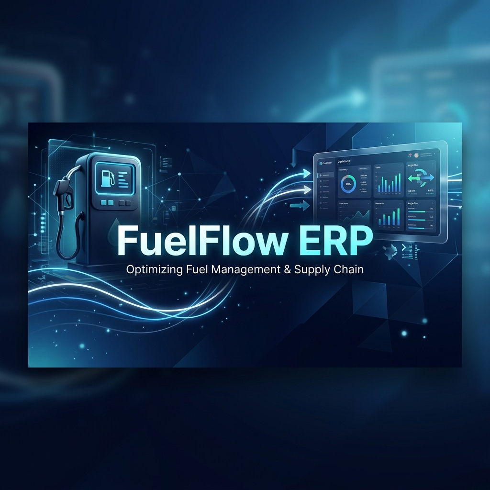
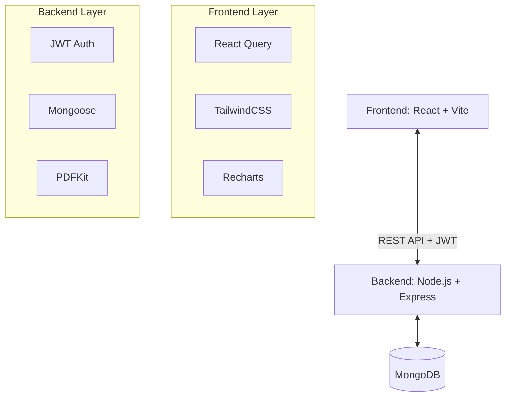

# ⛽ FuelFlow ERP — Smart Fuel Dispenser System



**FuelFlow ERP** is a comprehensive, enterprise-grade solution designed to streamline fuel station operations. Built on the modern MERN stack, it integrates vehicle identification, automated wallet-based payments, real-time inventory tracking, and advanced analytics into a single, intuitive interface.

---

## ✨ Key Features

### 🏢 Operations & Management
*   **Smart Dispenser Terminal**: A streamlined 3-step process for fuel dispensing: Identification → Selection → Confirmation.
*   **Inventory Control**: Real-time monitoring of fuel levels with automated alerts for low stock and easy restocking.
*   **Vehicle Wallet System**: Digital wallet management for vehicles, enabling prepaid fueling and automated billing.
*   **Dispenser Monitoring**: Track and manage multiple dispenser units across the station.

### 🔐 Security & Access
*   **Role-Based Access Control (RBAC)**: Distinct permissions for Admins, Operators, and Vehicle Owners.
*   **Secure Authentication**: JWT-based authentication with case-insensitive login and secure password hashing.
*   **Transaction Integrity**: Complete audit trails for every liter of fuel dispensed.

### 📊 Analytics & Reporting
*   **Executive Dashboard**: High-level overview of revenue, vehicle activity, and transaction trends.
*   **Detailed History**: Searchable and filterable transaction logs with date range support.
*   **Export Capabilities**: Generate PDF receipts and summaries for business operations.

---

## 🏗️ System Architecture



---

## 📁 Project Structure

```text
fuel-erp/
├── backend/            # Express.js Server
│   ├── models/         # MongoDB Schemas (User, Vehicle, Transaction, etc.)
│   ├── routes/         # API Endpoints
│   ├── middleware/     # Auth & Validation
│   └── seed.js         # Database Initialization
└── frontend/           # React Application
    ├── src/
    │   ├── pages/      # View components (Dashboard, Wallet, Inventory, etc.)
    │   ├── components/ # Reusable UI components
    │   ├── context/    # Global State (Auth)
    │   └── utils/      # API Config & Helpers
    └── index.css       # Global Styles & Theme
```

---

## 🚀 Getting Started

### Prerequisites
*   **Node.js**: v18 or higher
*   **MongoDB**: Local instance or Atlas cluster

### Installation

1.  **Clone the Repository**
    ```bash
    git clone https://github.com/yourusername/fuel-erp.git
    cd fuel-erp
    ```

2.  **Backend Setup**
    ```bash
    cd backend
    npm install
    cp .env.example .env # Configure MONGODB_URI and JWT_SECRET
    node seed.js        # Optional: Seed demo data
    npm run dev         # Start server on port 5000
    ```

3.  **Frontend Setup**
    ```bash
    cd ../frontend
    npm install
    npm run dev         # Start dev server on port 3000
    ```

---

## 🔑 Demo Access

| Role | Email | Password | Access Level |
| :--- | :--- | :--- | :--- |
| **Admin** | `admin@demo.com` | `admin123` | Full System Access |
| **Operator** | `operator@demo.com` | `oper123` | Daily Operations |
| **Vehicle Owner** | `owner@demo.com` | `owner123` | Wallet & Vehicle History |

---

## 🛠️ Technology Stack

*   **Frontend**: React 18, Vite, TailwindCSS, React Query, Recharts, Axios
*   **Backend**: Node.js, Express.js, MongoDB, Mongoose, JWT, bcryptjs
*   **Tools**: PDFKit (Receipts), Morgan (Logging), Dotenv (Config)

---

## 🤝 Contribution

Contributions are welcome! Please feel free to submit a Pull Request.

---

*Built with ❤️ for modern fuel management.*
